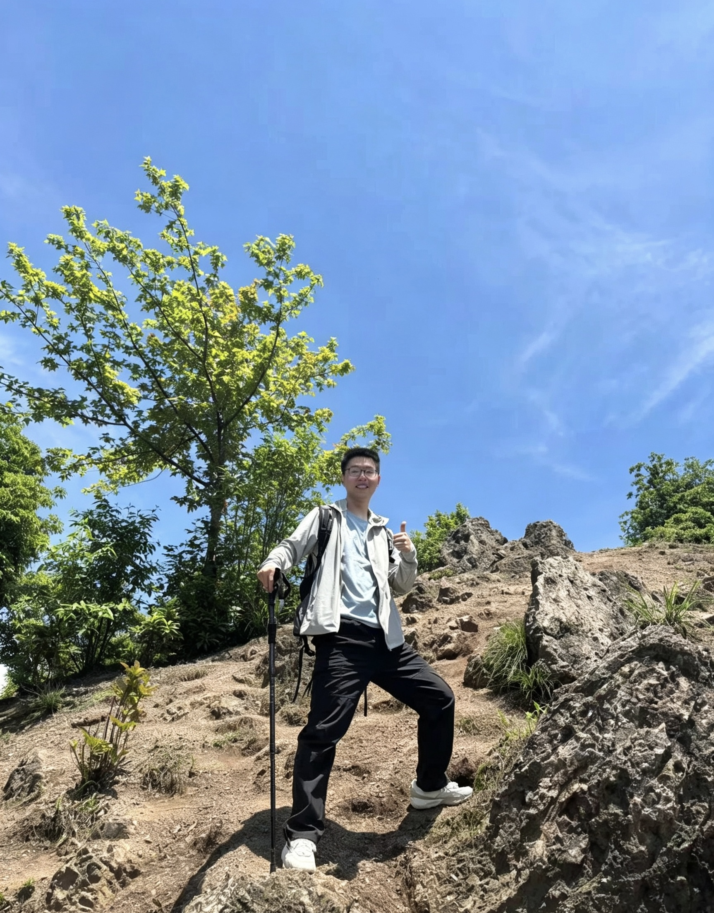

::: {.profile-row}

::: {.profile-left}
{.rounded-circle width="200"}

[周志伟]{.name-large}

::: {.profile-meta}
📍 湖北 · 武汉\
🎓 华中科技大学 博士\
🔬 光学工程 / 医学影像
:::
:::

::: {.profile-right}
我是一名物理算法工程师，现就职于武汉某医疗科技有限公司，主要负责内窥镜图像去噪与增强、导航相机标定等算法的研究与实现、超分辨定位成像中的图像处理方法与加速。

博士期间依托国家重大科研仪器研制项目，围绕超分辨定位成像开展算法研究，完成了从算法设计、GPU 并行加速到软件工程落地的完整闭环：包括基于深度学习的实时图像重建、基于残差生成器网络的图像修复，以及高通量单分子二维高斯拟合的 CUDA 并行实现，处理通量达到 700 万 emitters/s。

工程实践中以 C++/Python 为主要技术栈，擅长将深度学习模型通过 TensorRT、Onnxruntime 等推理引擎部署到实际设备，在保证算法精度的同时满足实时性要求；对 CUDA 并行计算、多线程编程、Qt 跨平台桌面应用开发也有较丰富的实践经验。

[📄 下载简历](ZhiweiZhou_CV.pdf){.btn .btn-primary .btn-sm}
[🐙 GitHub](https://github.com/zhiweizhou-think){.btn .btn-outline-secondary .btn-sm}
[📝 CSDN](https://blog.csdn.net/xingghaoyuxitong?type=blog){.btn .btn-outline-secondary .btn-sm}
[✉ 邮箱](mailto:1258806185@qq.com){.btn .btn-outline-secondary .btn-sm}
:::

:::

## 教育与工作经历

- 2023.07 - 至今：武汉某医疗科技有限公司，物理算法工程师
- 2019.09 - 2023.06：华中科技大学，武汉光电国家研究中心，光学工程，博士
- 2017.09 - 2019.09：华中科技大学，武汉光电国家研究中心，光学工程，硕士（硕博连读）
- 2013.09 - 2017.06：湖北大学，楚才学院，电子信息工程，学士（保送读研）

## 项目经历

### 基于深度学习的实时图像重建方法

- **时间**：2022.03 - 至今
- **方向**：视觉算法 - 模型推理
- **来源**：国家重大科研仪器研制项目——RNA 原位成像系统（1000 万）
- **问题**：现有方法图像重建速度慢
- **方法**：1）网络前几层去除上采样，减小显存消耗；2）使用 TensorRT 加速
- **结果**：保证 1~9 mol/μm² 高密度处理能力，实现 50 μm × 50 μm 视场大小的实时处理，论文撰写中
- **技能**：Python、C++、多线程、推理引擎（Onnxruntime、TensorRT）

### 基于残差生成器网络的图像修复方法

- **时间**：2019.06 - 2021.12
- **方向**：视觉算法 - 模型设计
- **来源**：国家重点基础研究计划（973 计划）——新型纳米超分辨结构宽场成像（97 万）
- **问题**：现有 Pix2pix 方法图像重建时产生了图像伪影（错误连接、结构缺失）
- **方法**：使用 ResNet 生成器替代 Pix2pix 方法中基于 U-Net 的生成器
- **结果**：解决了 Pix2pix 图像修复的伪影问题，见研究成果 1
- **技能**：Python、PyTorch、基于深度学习的图像超分辨方法（CNN、GAN）

### 基于 CUDA 的并行计算加速单分子定位成像

- **时间**：2017.06 - 2019.06
- **方向**：视觉算法 - 图像处理加速
- **来源**：国家重点科研仪器研制专项——基于荧光分子纳米分辨定位的超分辨定位成像仪器（700 万）
- **问题**：单分子定位成像数据处理慢
- **方法**：利用 GPU 的并行计算能力，高通量处理单分子二维高斯拟合任务，并基于 Java 完成软件界面开发
- **结果**：能够实时处理采集的图像，通量达到 700 万 emitters/s，见研究成果 3
- **技能**：C++、CUDA、Java Swing、JNI 通信、BFGS 优化算法

## 研究成果

1. **Zhiwei Zhou**, Weibing Kuang, Zhengxia Wang\*, Zhenli Huang\*. ResNet-based image inpainting method for enhancing the imaging speed of single molecule localization microscopy. *Optics Express*, 2022.
2. Mingtao Shang, **Zhiwei Zhou**, Weibing Kuang, Yujie Wang\*, Bo Xin, and Zhenli Huang. High-precision 3D drift correction with differential phase contrast images. *Optics Express*, 2021.
3. Luchang Li, Bo Xin, Weibing Kuang, **Zhiwei Zhou**, and Zhenli Huang\*. Divide and Conquer: Real-time maximum likelihood fitting of multiple emitters for superresolution localization microscopy. *Optics Express*, 2019.

## 专业技能

- **编程语言**：C/C++（熟悉）、Python（熟悉）、MATLAB（熟悉）、Java（了解）
- **证书**：全国计算机等级考试嵌入式三级、H3C 初级网络工程师、CET-6
- **其他**：图像处理仿真与硬件平台（FPGA）实现、导航相机标定仿真与硬件平台（Linux-Zynq）实现、OpenCV、CUDA 并行计算与加速
